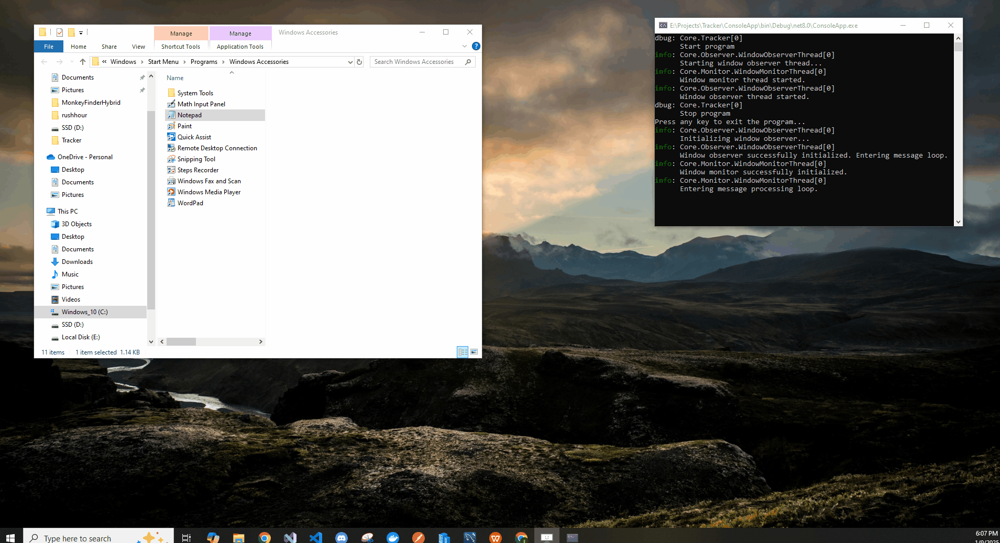

## About the Project

**Tracker** — a solution for tracking launched windows of specific processes.

### System Requirements
- Supported OS: Windows
- Platform Target: x64

### Current Functionality
Currently, the following processes are being tracked:
- Notepad
- Chrome

To add a new process for tracking, you need to extend the `Core.Enums.SystemProcesses` enumeration.

### Usage Example
